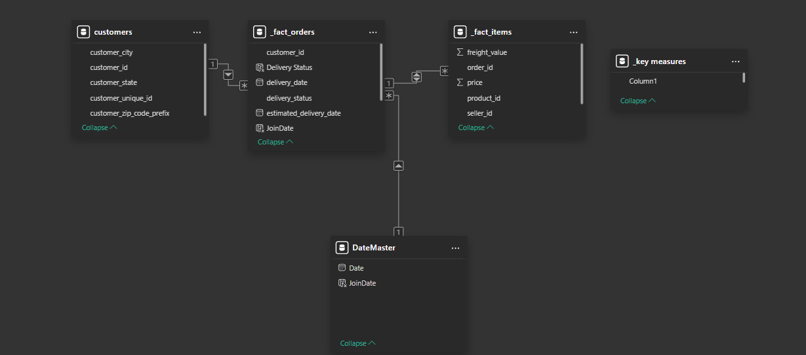

# 🇧🇷 Olist E-Commerce 360: Supply Chain & Revenue Analysis


## 📌 Project Overview
**The Scenario:** Olist is a large Brazilian e-commerce marketplace. The operations team is facing complaints about delivery delays but lacks visibility into *where* these bottlenecks are happening and how they impact revenue.

**The Solution:** I built an end-to-end Business Intelligence solution to track the full order lifecycle—from purchase to delivery. The final dashboard provides a "360-degree" view of Sales (Revenue Growth) and Logistics (Shipping Performance).

## 🛠️ Technical Implementation

### 1. Data Modeling (Star Schema)
To ensure high performance and accurate filtering, I transformed the raw flat files into a **Star Schema** architecture.
* **Fact Table:** `_fact_orders` (Transactional data).
* **Dimension Tables:** `customers`, `products`, `sellers`, `date_master`.
* **Result:** This model allows for complex slicing by State, Product Category, and Time without performance lag.


*Figure 1: The Star Schema relationship diagram connecting Orders to multiple Dimensions.*

### 2. Advanced DAX (Time Intelligence)
I used DAX to engineer metrics that don't exist in the raw data.
* **Month-over-Month (MoM) Growth:** Used `VAR` and `CALCULATE` to compare current sales vs. the previous month.
* **Logistics Logic:** Created a dynamic `Delivery Status` column to flag orders as **"Late"** or **"On Time"** based on the estimated vs. actual delivery date.

### 3. Logic Design (SQL)
Before visualization, I designed the categorization logic using SQL Common Table Expressions (CTEs). This ensured the business definitions for "Fast Shipping" and "Major Delays" were robust.

```sql
/* Logic Design for Delivery Performance Categorization */
WITH state_logistics AS (
    SELECT 
        customer_state,
        DATEDIFF(delivery_date, estimated_date) AS delay_days,
        CASE 
            WHEN DATEDIFF(delivery_date, estimated_date) > 3 THEN 'Major Delay'
            ELSE 'On Time'
        END AS status
```
## 🔍 Key Business Insights
Logistics Bottlenecks: Certain states have a disproportionately high "Late Delivery" rate, correlating with lower review scores.

Revenue Trends: Sales peak significantly in Q4, but logistics performance dips during these spikes, indicating a need for seasonal carrier scaling.

Shipping Impact: Orders delivered in under 3 days (Fast Shipping) drive higher average order value compared to standard shipping.

## 📂 Files in this Repository
Olist_Ecommerce_360.pbix: The complete Power BI Dashboard file.

olist_analysis.sql: The SQL script used for data cleaning and logic validation.

data_model.png: Screenshot of the Star Schema architecture.
    FROM orders
)
SELECT * FROM state_logistics
